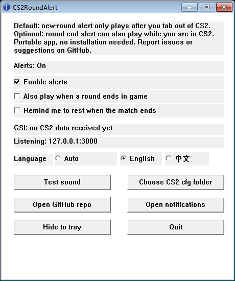

# CS2RoundAlert

[中文说明](README.zh-CN.md)

A lightweight, portable Windows utility for Counter-Strike 2.

When you tab out of CS2, it plays a sound when the next round starts.

## Download

Download this file:

<https://github.com/BannerLord54/CS2RoundAlert/releases/latest/download/CS2RoundAlert.exe>

Download `CS2RoundAlert.exe`, not `Source code`.

## How To Use

1. Run `CS2RoundAlert.exe`.
2. Click `Test sound`.
3. Start or restart CS2.
4. Keep CS2RoundAlert running.

Done.

Optional:

- Enable `Also play when a round ends in game` if you want a sound at round end too.
- Enable `Remind me to rest when the match ends` if you want a break reminder after a full match.
- Close the window to hide it to the tray.
- Open the exe again to show the existing window.

## No Sound

Check these:

1. Click `Test sound`.
2. Make sure `Enable alerts` is checked.
3. Restart CS2 once.
4. For new-round alerts, tab out of CS2.
5. If the app says `no CS2 data received yet`, CS2 has not loaded the config.
6. If rest reminders do not appear, click `Open notifications` and allow notifications.

## Safety

CS2RoundAlert uses Valve's official Game State Integration.

It does not:

- read game memory
- inject code
- simulate mouse or keyboard input
- control gameplay

It only receives JSON from CS2 on your own computer.

Valve GSI docs:

<https://developer.valvesoftware.com/wiki/Counter-Strike:_Global_Offensive_Game_State_Integration>

## Windows Warning

This is a portable app. No installation is required.

Windows SmartScreen or antivirus software may warn because the exe is not code-signed.

To make it easy to check:

- source code is public
- exe is built by GitHub Actions
- release includes SHA256
- no packer, no obfuscation

Report issues or suggestions on GitHub.

## License

MIT
