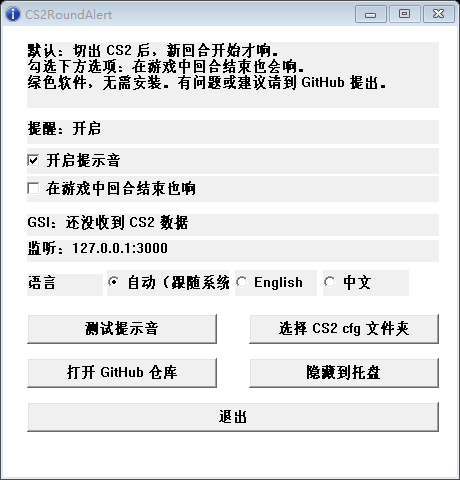

# CS2RoundAlert

[English README](README.md)

一个给 CS2 用的 Windows 小工具。

你切出 CS2 后，新回合开始会响一声。

## 下载

下载这个文件：

<https://github.com/BannerLord54/CS2RoundAlert/releases/latest/download/CS2RoundAlert.exe>

下载 `CS2RoundAlert.exe`，不要下载 `Source code`。

## 怎么用

1. 运行 `CS2RoundAlert.exe`。
2. 点 `测试提示音`。
3. 启动或重启 CS2。
4. 让 CS2RoundAlert 保持运行。

结束。

可选：

- 想让回合结束也响，勾选 `在游戏中回合结束也响`。
- 关闭窗口只是隐藏到托盘。
- 再次打开 exe 会显示已有窗口，不会重复开多个。

## 没声音

按顺序检查：

1. 点 `测试提示音`。
2. 确认 `开启提示音` 已勾选。
3. 重启一次 CS2。
4. 测试新回合提醒时，要切出 CS2。
5. 如果窗口显示 `还没收到 CS2 数据`，说明 CS2 没读到配置。

## 安全说明

CS2RoundAlert 使用 Valve 官方 GSI 功能。

它不会：

- 读取游戏内存
- 注入代码
- 模拟鼠标键盘
- 自动操作游戏

它只接收 CS2 在你电脑本地发来的 JSON。

Valve GSI 文档：

<https://developer.valvesoftware.com/wiki/Counter-Strike:_Global_Offensive_Game_State_Integration>

## Windows 风险提示

这是绿色软件，无需安装。

因为 exe 没有代码签名，Windows SmartScreen 或杀毒软件可能提示风险。

为了方便检查：

- 源码公开
- exe 由 GitHub Actions 构建
- Release 附带 SHA256
- 没有加壳、混淆、压缩壳

有问题或建议请到 GitHub 提出。

## 许可证

MIT
